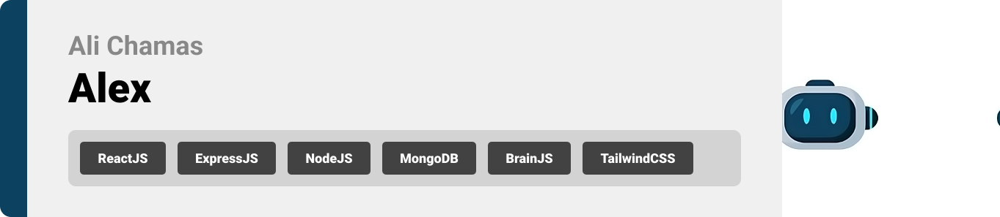
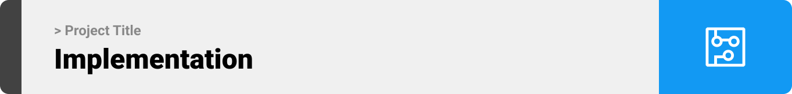
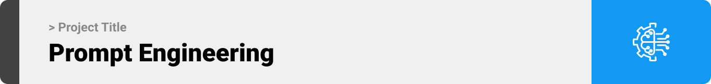

<br><br>

<!-- project philosophy -->


> A machine learning game, where kids and even adults can learn machine learning by building testing and using their own models using NO CODE.
> At Alex, users will choose a level (Text recognition, image recognition or numbers recognition), choose a game and build an AI model based on the requirements of this game.
> After building the model, users can test it, then deploy it to scratch via Alex's extension to play with their model and finish the game! Each time a user finish a game he will unlock another.

### User Stories

- As a user:
- I'm interested in machine learning but want to learn it in a fun and challenging way.
- I don't want to learn machine learning through courses since I can't code. I want to build my model using no-code tools.
- I want to use my model in Scratch to create a character that represents my model and play with it.
- As a content creator:
- I aim to invent new game ideas and create step-by-step tutorials for solving them.
- I plan to post these games and their solutions on the website after getting admin approval.
- I want to track user progress to see if they enjoy my games

<br><br>

<!-- Tech stack -->


### Alex is built using the following technologies:

- This project uses the [React.js Library](https://react.dev/). React.js is a JavaScript library for building user interfaces, especially single-page web applications.
- For persistent storage (database), the app uses the [MongoDB](https://www.mongodb.com/) NoSQL database that uses a document-oriented data model, making it easy to store and retrieve data in a flexible JSON-like format.
- For the backend, [Node.js](https://nodejs.org/) with [Express](https://expressjs.com/) is utilized, providing a robust framework for building scalable and efficient server-side logic
- For Machine Learning, [Brain.js](https://brain.js.org/) is used to allow users to create their custom text-recognition models. Brain.js is a JavaScript library for building and training neural networks, useful for tasks like data analysis and pattern recognition.

<br><br>

<!-- UI UX -->


> We designed Coffee Express using wireframes and mockups, iterating on the design until we reached the ideal layout for easy navigation and a seamless user experience.

- Project Figma design [figma](https://www.figma.com/file/LsuOx5Wnh5YTGSEtrgvz4l/Purrfect-Pals?type=design&node-id=257%3A79&mode=design&t=adzbABt5hbb91ucZ-1)

### Mockups

| Home screen                             | Menu Screen                           | Order Screen                          |
| --------------------------------------- | ------------------------------------- | ------------------------------------- |
|  |  |  |

<br><br>

<!-- Database Design -->


### Architecting Data Excellence: Innovative Database Design Strategies:

- Insert ER Diagram here

<br><br>

<!-- Implementation -->


### User Screens (Mobile)

| Login screen                              | Register screen                         | Landing screen                          | Loading screen                          |
| ----------------------------------------- | --------------------------------------- | --------------------------------------- | --------------------------------------- |
|  |  |  |  |
| Home screen                               | Menu Screen                             | Order Screen                            | Checkout Screen                         |
|  |  |  |  |

### Admin Screens (Web)

| Login screen                            | Register screen                       | Landing screen                        |
| --------------------------------------- | ------------------------------------- | ------------------------------------- |
|  |  |  |
| Home screen                             | Menu Screen                           | Order Screen                          |
|  |  |  |

<br><br>

<!-- Prompt Engineering -->


### Mastering AI Interaction: Unveiling the Power of Prompt Engineering:

- This project uses advanced prompt engineering techniques to optimize the interaction with natural language processing models. By skillfully crafting input instructions, we tailor the behavior of the models to achieve precise and efficient language understanding and generation for various tasks and preferences.

<br><br>

<!-- AWS Deployment -->


### Efficient AI Deployment: Unleashing the Potential with AWS Integration:

- This project leverages AWS deployment strategies to seamlessly integrate and deploy natural language processing models. With a focus on scalability, reliability, and performance, we ensure that AI applications powered by these models deliver robust and responsive solutions for diverse use cases.

<br><br>

<!-- Unit Testing -->


### Precision in Development: Harnessing the Power of Unit Testing:

- This project employs rigorous unit testing methodologies to ensure the reliability and accuracy of code components. By systematically evaluating individual units of the software, we guarantee a robust foundation, identifying and addressing potential issues early in the development process.

<br><br>

<!-- How to run -->


> To set up Coffee Express locally, follow these steps:

### Prerequisites

This is an example of how to list things you need to use the software and how to install them.

- npm
  ```sh
  npm install npm@latest -g
  ```

### Installation

_Below is an example of how you can instruct your audience on installing and setting up your app. This template doesn't rely on any external dependencies or services._

1. Get a free API Key at [example](https://example.com)
2. Clone the repo
   git clone [github](https://github.com/your_username_/Project-Name.git)
3. Install NPM packages
   ```sh
   npm install
   ```
4. Enter your API in `config.js`
   ```js
   const API_KEY = "ENTER YOUR API";
   ```

Now, you should be able to run Coffee Express locally and explore its features.
